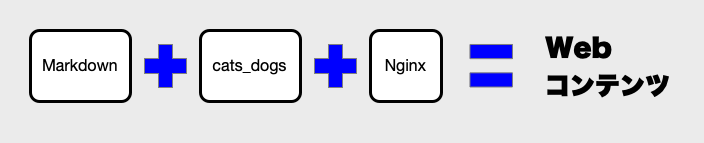
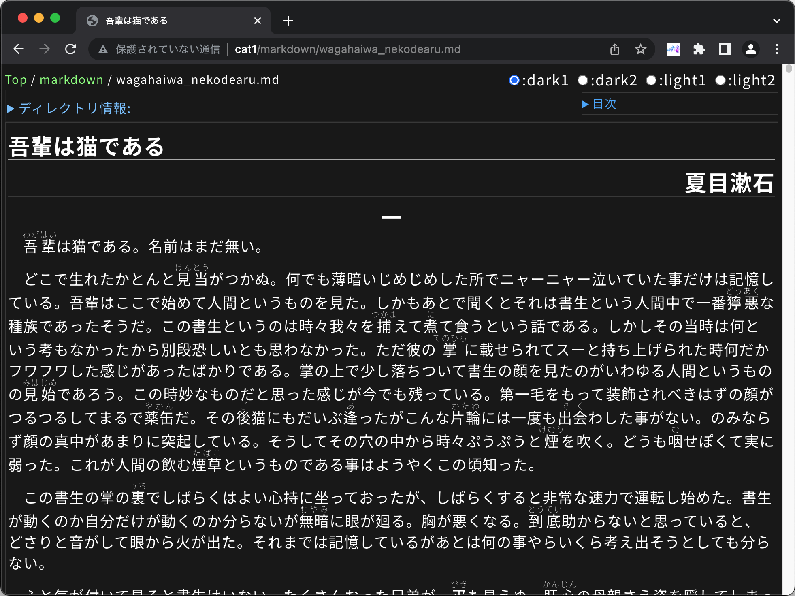
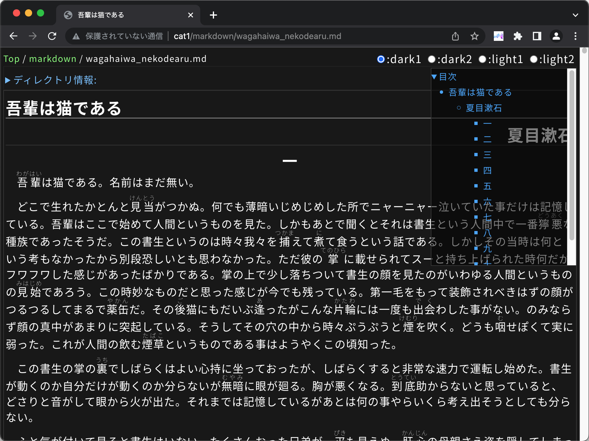
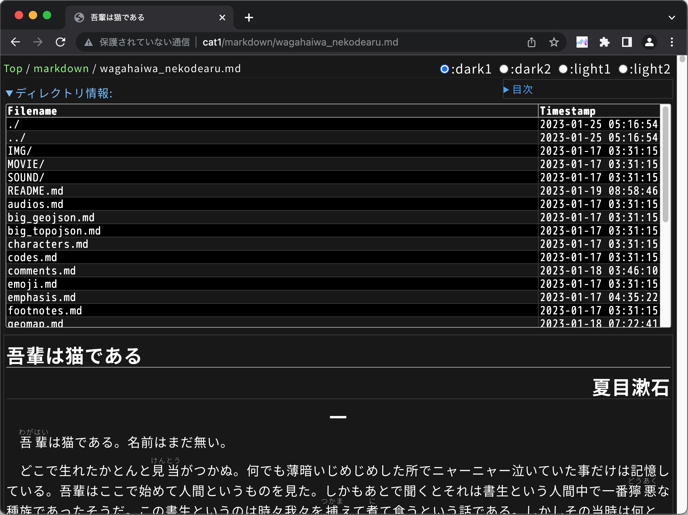
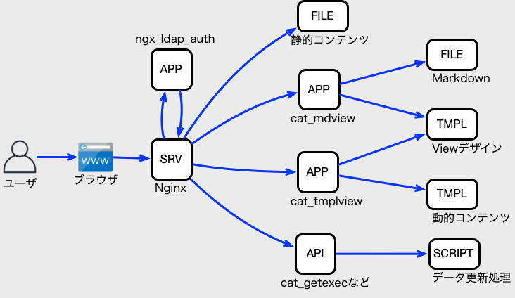

[cats\_ample]: https://github.com/1f408/cats_ample
[cat\_om]: https://github.com/1f408/cat_om
[cat\_nofn]: https://github.com/1f408/cat_nofn
[デモの設定サンプル]: https://github.com/1f408/cats_ample
[デモのYoubube動画]: https://www.youtube.com/playlist?list=PLTKODctBx8g-gmC8lrM2KeRM5N7qXCdcE
[1f408 Orgianizatoin]: https://1f408.github.io/pages/
# cats\_dogs(CAT'S DOCument System)

cats\_dogsは、DB不要なMarkdownファイルベースのドキュメントシステムです。  
MarkdownファイルとNginxを使って、手軽にWebコンテンツを提供する仕組みです。



## 目的

cats\_dogsは「メモ的に情報を楽に共有したい」ので作りました。

ブラウザがあれば、Webページを見ることは比較的簡単ですが、Webページを作ろうと思ったら、HTML書いたり、CMS管理したり、なかなか面倒です。  
しかし、Webコンテンツとして共有したいのは、手間やコストがかけられる芸術的なコンテンツばかりではありません。  
メモ的に、低コストで楽に作って共有できる、そんな、手軽さが重要な用途もたくさんあります。

Webのそんな手軽さが求められる用途での、以下の3つの「手軽さ」を目指して作られたのがcats\_dogsです。

1. 書く手軽さ
    - Markdownで書けるようにした。
2. 管理する手軽さ
    - DBレスにして管理の手間を減らした。
3. 見る手軽さ
    - Webコンテンツの見やすさを重視した。

このように、cats\_dogsは、Web向きな情報を手軽に共有することが目的です。

## 画面イメージ

<details>
<summary>ファイルを表示した画面</summary>



</details>

<details>
<summary>目次を開いた画面</summary>



</details>

<details>
<summary>ディレクトリ情報を表示した画面</summary>



</details>

## 構築デモと設定サンプル

cats\_dogsは、用途に応じて柔軟にカスタマイズして使う為、決まった使い方がありません。  
そこで、以下のページで、デモ動画などをつかって、いくつかの構築方法や設定を紹介しています。

- [デモの設定サンプル]
- [デモのYoubube動画]

## 特徴

cats\_dogsは、手軽さのため、以下の問題を解決するように作られています。

1. メモを書く+α程度の手軽さが欲しい。
    - CMSの構築やDBの運用は、面倒すぎる。
    - テキストやコメントを書くぐらいの手軽さがよい。頑張ってもMarkdown程度ぐらいが限界。
2. 一般的な書式で書きたい。
    - アプリ独自のMarkdownフォーマットでは、使い難い。
    - GithubのMarkdownがデファクトなんだから、GithubのMarkdownとの互換性がほしい。
3. 共有するので、見た目は相手によって変わって欲しくない。
    - 名前などの固有名詞の漢字が化けて欲しくない。(第4水準の漢字ぐらいは、表示して欲しい)
    - OSやブラウザが違っても表示できて欲しい。
4. 出来るだけ軽く動いて欲しい。
    - 非力なサーバで動かないとコストがかかりすぎる。
    - 構築した後は、楽に使いたい。DBの管理みたいな面倒なことはしたくない。
    - HTTPのキャッシュの仕組みがちゃんと動いて欲しい。
5. 見やすくするため、手軽にカスタマイズできないと困る。
    - 用途に合わせて、見た目を変えたい。
    - 見る人に合わせて、見せる文章を切り替えたい。
    - 人数が増えても使えるように、キャッシュなどの高速化のカスタマイズができるとうれしい。

この結果、以下のような手軽さが重要な、たくさんの用途で使える物になりました。

- 自分用メモWebアプリ
- メモ共有サイト(MarkdownなWikiもどき)
- 動画紹介記事サイト
- 講義資料サイト
- 作業手順サイト
- 部署サイト
- 簡易GitHubもどきサイト(cats\_dogs+gitで実現)
- GitBookもどきサイト
- などなど

そして、この多用途な特徴だけでなく、「手軽さ」に関して、以下のようなたくさんの特徴を持っています。

1. 書く手軽さ
    - GitHub.comのMarkdown処理との高い互換性
        - [GFM(GitHub Flavored Markdown Spec)](https://github.github.com/gfm/)に対応してる。
        - emoji表記、数式(MathJax/LaTex形式)、mermaid形式、GeoJSONマップにも対応している。(設定で必要な拡張の有効化が必要)
    - Markdown処理の柔軟なカスタマイズ機能
        - 設定ファイルでMarkdown拡張機能の有効無効に変更できる。
    - ファイルベースシステム
        - gitやtarなどのファイル用のツールで、バックアップやデータ共有ができる。
2. 管理する手軽さ
    - DBレス(RDBレス、KVSレス)
        - RDB(MariaDB, MySQL, PostgreSQL等)を使わないので、運用や管理で楽できる。
    - Nginx専用設計(Nginxでモジュール群を連係)
        - Nginxの設定を使って、かなり自由にカスタマイズできる。
        - 静的ファイルはNginxが直接処理するので、高速動作する。
        - Nginxのプロキシキャッシュ制御に対応していて、動的コンテンツも軽量動作する。
    - 動的コンテンツのdump(静的コンテンツ化)機能
        - 動的コンテンツもNginxにオフロードして、負荷を軽減できる。
3. 見る手軽さ
    - 日本語Webフォント対応
        - JIS第1〜4水準漢字をサポートした以下の4種のフォントを標準設定済み
            - Noto Sans CJK JP(ゴシック体)
            - Noto Serif CJK JP(明朝体)
            - Rounded Mgen+ 1pp(丸ゴシック体)
            - Rounded Mgen+ 1m(等幅の丸ゴシック体)
        - フォント追加変更もできる。(webフォント作成は、[cat\_nofn]を利用)
    - 見た目のカスタマイズも可能
        - Goのtext/templateとCSSで自由に変更できる。
        - 簡単にテーマカラーを切り替えられる。

## ビルド手順

システム全体の構築方法については、[cats\_ample]を参照してください。  
ここでは、cats\_dogsのモジュール群だけのビルド手順のみを記述します。

1. Goをインストールする。
    - [go.devのDownload and install](https://go.dev/doc/install)などを参照して、Goをインストールします。
1. ソースをダウンロードする。(作業用のディレクトリで、`git clone`を実行)  
    ```
    git clone git@github.com:1f408/cats_dogs.git
    ```
1. `cats_dogs`ディレクトリに移動する。
    ```
    cd cats_dogs
    ```
1. `./build.sh`を実行する。
    ```
    ./build.sh
    ```
    - このスクリプトでは、Goを実行してcats\_dogsをビルドします。ビルドしたプログラムは`./bin`ディレクトリへ置かれます。
    - ビルド中にGoの外部ライブラリをダウンロードするため、ネットワーク環境が必要です。
1. 適切なパスへ`./bin`ディレクトリのファイルをコピーする。
    - cats\_dogsのモジュールの使い方は、モジュール群の説明を参照してください。

## Markdown書式の仕様

cats\_dogsのMarkdown処理は、GitHubとの互換性を意識した作りになっていますが、
余計な機能を無効にして、シンプルなMarkdownの仕様にすることも出来ます。  
用途に合わせて自由にカスタマイズして利用してください。

設定方法やMarkdown処理の詳細については、[cats\_dogsのMarkdown処理](markdown_format.md)を参照してください。

## システム構造

cats\_dogsは、以下の図のように、複数のモジュールが連係して動作します。



モジュールの組み合わせは、用途に合わせて、必要な機能に合わせて、変更します。  
そして、各種モジュールは以下のような機能を担当しています。

- Nginx
    - HTTP処理
    - キャッシュ管理
    - コンテンツやモジュールへの処理の振り分け
- [ngx\_auth\_mod](https://github.com/iij/ngx_auth_mod) (別モジュール)
    - LDAPでの認証処理
- **cat\_getexec**
    - 出力を伴うシンプルなAPIを提供
- **cat\_multi_getexec**
    - 出力を伴うシンプルなAPIを複数提供
    - cat_tmplviewと連携して、シンプルなUIを量産する仕組みの一部です。
- **cat\_mdview**
    - Markdownドキュメント表示
- **cat\_tmplview**
    - ユーザ権限に合わせたコンテンツの生成

## モジュール群

プログラムやモジュールの詳細については、以下のドキュメントを参照してください。

- [ngx\_auth\_mod](https://github.com/iij/ngx_auth_mod) 
    - 認証を担当します。
    - 汎用性が高いため、別のレポジトリに分かれていますが、 組み合わせて使うことを想定して作られています。
- [cat\_getexec](cat_getexec.md)
    - 出力を伴う雑多なAPIを提供します。
    - スクリプトを呼び出すことでAPIを実現する構造になっているため、APIの追加や変更を柔軟に行うことが可能です。
- [cat\_multi\_getexec](cat_multi_getexec.md)
    - 出力を伴う雑多なAPIを複数提供します。APIは同じ権限で動作しますので、細やかな権限管理はできなくなります。実行毎にAPI設定を読み込むオーバーヘッドが存在します。
    - スクリプトを呼び出すことでAPIを実現する構造になっているため、APIの追加や変更を柔軟に行うことが可能です。([Cat UI](cat_ui.md)の一部)
- [cat\_tmplview](cat_tmplview.md)
    - ユーザの権限に合わせて、テキストコンテンツを出し分けるためのWebアプリです。[Cat UI](cat_ui.md)の一部でもあります。
- [cat\_mdview](cat_mdview.md)
    - Markdownコンテンツを表示するためのWebアプリです。
- [cat\_verify\_type](cat_verify_type.md)
    - シェルスクリプトでIPアドレスやURLなどのチェックしにくい入力をチェックする支援ツールです。([Cat UI](cat_ui.md)の支援ツール)
- [cat\_args2csv](cat_args2csv.md)
    - シェルスクリプトからRFC1480準拠のCSVを出力するための支援ツールです。([Cat UI](cat_ui.md)の支援ツール)
- [cat\_printcsv](cat_printcsv.md)
    - シェルスクリプトからRFC1480準拠のCSVを一行だけ出力するための支援ツールです。([Cat UI](cat_ui.md)の支援ツール)
- [cat\_ui.js](./cat_ui_js.md)
    - cat_uiテンプレート関数をサポートするJavaScriptプログラムです。([Cat UI](cat_ui.md)の一部)

## Cat UI(プラットフォーム)

cats\_dogsには、**Cat UIプラットフォーム**という、APIおよびWeb UIを量産するための仕組みがあります。  
この仕組みを使うことで、APIやWeb UIを容易に作れます。例えば、`git pull`してレポジトリと同期するWeb UIを作れば、git+cats\_dogsで、簡易Githubもどきが実現可能になります。

詳細は[Cat UI(プラットフォーム)](cat_ui.md)を参照してください。

## 関連プロダクトおよび関連サイト

- [1f408 Orgianizatoin]
    - 関連プロダクトの紹介
    - cats\_dogsの関連プロダクト全貌を知りたいあなたへ
- [cats\_ample]
    - 構築方法や設定方法をデモ動画を使って紹介
    - cats\_dogsの使い方を知りたいあなたへ
- [cat\_om]
    - gitレポジトリfeed生成ツール
    - gitのレポジトリと連係させた結果を、更新情報へAtom feedとして提供したいあなたへ
- [cat\_nofn]
    - cats\_dogsのためにつくった、サブセットフォント分割とフォント設定CSS生成ツール
    - 好きなフォントをwebフォントとして使いまくりたいあなたへ

## 内部仕様

- [ファイル構成](file_tree.md)
