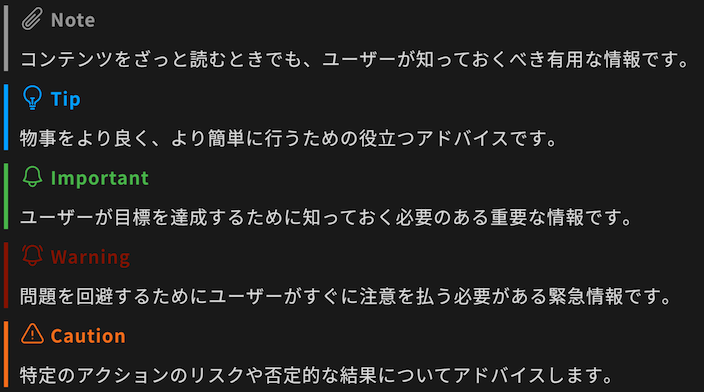

[GitHubのアラート拡張の経緯]: https://github.com/orgs/community/discussions/16925
[GitHubのアラート拡張のリリース文]: https://github.blog/changelog/2023-12-14-new-markdown-extension-alerts-provide-distinctive-styling-for-significant-content/
[GitHubのアラート拡張の説明]: https://docs.github.com/ja/get-started/writing-on-github/getting-started-with-writing-and-formatting-on-github/basic-writing-and-formatting-syntax#alerts
[Microsoft Learnのアラート拡張の説明]: https://learn.microsoft.com/ja-jp/contribute/content/markdown-reference#alerts-note-tip-important-caution-warning
[GitHub]: https://github.com/
[Microsoft Learn]: https://learn.microsoft.com/

# GitHub Alerts Markdown拡張について

cats\_dogsのAlerts拡張は、コンテンツの重要性を示す色とアイコンを使用してレンダリングされるブロック引用符を作成するための Markdown 拡張機能です。  
Alerts拡張を[GitHub]コンテンツとの互換性のために実装したものです。

[Microsoft Learnのアラート拡張の説明]では、注意とともに、アラート拡張について以下のように説明されています。

> アラートは、コンテンツの重要性を示す色とアイコンを使用して Microsoft Learn でレンダリングされるブロック引用符を作成するための Markdown 拡張機能です。
> 
> メモ、ヒント、重要なボックスは避けてください。 閲覧者は、これらをスキップする傾向があります。 記事のテキストにその情報を直接配置することをお勧めします。

Alerts拡張は、[GitHub]および[Microsoft Learn]の独自拡張の記述方法です。利用にはご注意ください。

このMarkdown拡張の仕様については、以下のドキュメントを参照してください。

- [Microsoft Learnのアラート拡張の説明]
- [GitHubのアラート拡張の説明]
- [GitHubのアラート拡張のリリース文]
- [GitHubのアラート拡張の経緯]

## Alerts拡張のMarkdown記述方法

テキスト引用(blockquote)の記法のうち、先頭行が特定の文言の場合、レンダリングが変わるようになります。

例えば、「Note」の文言タイトルが付くアラート拡張(NOTEアラート種別)は、以下のように記述します。

```
> [!NOTE]
> コンテンツをざっと読むときでも、ユーザーが知っておくべき有用な情報です。
```

アラート拡張の先頭行として指定できるデフォルトの文言は以下の5種類です。

|先頭行の文言|アラート種別|
| :--- | :--- |
|`> [!NOTE]`|`NOTE`|
|`> [!TIP]`|`TIP`|
|`> [!IMPORTANT]`|`IMPORTANT`|
|`> [!WARNING]`|`WARNING`|
|`> [!CAUTION]`|`CAUTION`|

互換性はなくなりますが、cat\_dogsでは、利用できるアラート種別(先頭行の文言)は変更可能です。  
アラート種別の変更方法の詳細については、[cats\_dogsのMarkdown処理](markdown_format.md)を参照してください。

## レンダリングイメージ

以下が、Alerts拡張を有効にした場合の、デフォルト設定での記述例とそのレンダリングイメージです。

``` md
> [!NOTE]
> コンテンツをざっと読むときでも、ユーザーが知っておくべき有用な情報です。

> [!TIP]
> 物事をより良く、より簡単に行うための役立つアドバイスです。

> [!IMPORTANT]
> ユーザーが目標を達成するために知っておく必要のある重要な情報です。

> [!WARNING]
> 問題を回避するためにユーザーがすぐに注意を払う必要がある緊急情報です。

> [!CAUTION]
> 特定のアクションのリスクや否定的な結果についてアドバイスします。
```


