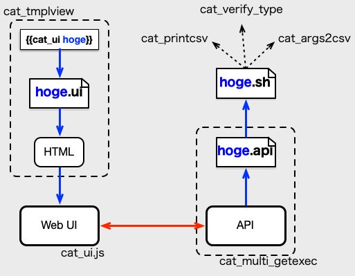

# Cat UI(プラットフォーム)

**Cat UI**(プラットフォーム)は、Web UI(およびAPI)を楽に量産するための仕組みです。  
この仕組みを使うことで、APIやUIが容易に作ることを可能にします。

一般的には、APIを作ろうとすると、CGIやAPIサーバのプログラムが必要になります。やりたいこと自体は、コマンドをいくつか実行する程度の内容なことが良くあります。  
そこで、APIに必要な機能のうち、スクリプト自体を除く、以下の機能を代行する仕組みをcats\_dogsに組み込みました。

- スクリプトをAPI経由で実行する仕組み(**cat\_mult\_getexec**が担当)
- APIを呼び出すルール設定(**Cat UI**設定ファイル)
- APIの入出力をWeb UIフォームに変換する仕組み(**cat\_tmplview**と**cat\_ui.js**が担当)

これが、**Cat UIプラットフォーム**です。要は、cats\_dogsでは、簡単なスクリプトと設定ファイルで、APIとWeb UIが実現できるわけです。

## APIの仕様

スクリプトで簡易に実装することを実現する為に、APIの仕様を、以下のように単純な機能に限定しています。

- 入力は、URLパラメータのみ
- 出力は、plain/textとCSVフォーマット(RFC4180準拠)のみ

## スクリプト作成の支援機能

シェルスクリプトによる、Cat UI用のスクリプト作成を容易にするため、cats\_dogsには以下の支援のためのコマンドが含まれています。

- [cat\_verify\_type](cat_verify_type.md) - 入力のバリデーション(入力値からの保護)をサポート
- [cat\_args2csv](cat_args2csv.md)、[cat\_printcsv](cat_printcsv.md) - CSV出力をサポート

## 動作概略

**Cat UIプラットフォーム**は、**cat\_tmplview**、**cat\_ui.js**、**cat\_mult\_getexec**が連係することで実現していて、以下のような構造になっています。

Cat UIが使われると、具体的には以下のような処理が行なわれます。

1. アクセスされたURLに対応するテンプレートファイルを変換される。(**cat\_tmplview**の処理)
2. `{{cat_ui UI名}}`のテンプレート処理で、指定したUI名のUI設定ファイル(UI名 + `.ui`)したがって、HTMLを生成する。(**cat\_tmplview**の処理)
3. UI(HTML)にAPI呼び出し処理を設定する。(**cat_ui.js**の処理)
4. APIがAjax的に呼び出される。(**cat\_ui.js**の処理)
5. APIのURLからAPI名を取り出す。(**cat\_multi\_getexec**の処理)
6. API設定ファイル(API名 + `.api`)に従って、スクリプトを実行する。(**cat\_multi\_getexec**の処理)
7. スクリプトの結果を、API設定ファイルに従って、応答する。(**cat\_multi\_getexec**の処理)

## Cat UI設定ファイル群

Cat UIプラットフォームでは、以下の、3種類のファイル(1つはスクリプト)を用意することで、UIおよびAPIが追加できます。

### UI設定ファイル(`*.ui`)

Web UIの入力パラメータとその表示用のラベルをしていするファイルです。
**UI名**にUI設定ファイルの拡張子(デフォルトは`ui`)をつけたファイル名です。  
ファイルの書式については、[cat\_tmplview](cat_tmplview.md)のUI設定ファイルの説明を参照してください。

### API設定ファイル(`*.api`)

APIが実行するシェルスクリプトとその引数にわたす値を指定するファイルです。
**UI名**にAPI設定ファイルの拡張子(デフォルトは`api`)をつけたファイル名です。  
ファイルの書式については、[cat\_multi\_getexec](cat_multi_getexec.md)のAPI設定ファイルの説明を参照してください。

### API用スクリプト(`*.sh`)

API設定ファイルで指定する、APIの実処理を担うスクリプトです。
スクリプトの呼び出しの仕様については、[cat\_multi\_getexec](cat_multi_getexec.md)のAPI設定ファイルの説明を参照してください。  
スクリプトの作成をサポートするプログラム([cat\_verify\_type](cat_verify_type.md)、[cat\_args2csv](cat_args2csv.md)、[cat\_printcsv](cat_printcsv.md))を使うことで、入力のバリデーションやCSVの出力が簡単に行なえるようになっています。

## 構築フロー

Cat UIプラットフォーム構築の流れは以下のようになります。詳細は各プログラムの仕様を確認してください。

1. Nginxが**cat\_multi\_getexec**を呼び出すようにする。  
    1. **cat\_multi\_getexec**を動作させる。  
    2. API専用のパス(/api等)を決めて、nginxにそのパスに**cat\_multi\_getexec**用のproxy設定を追加する。  
    3. API専用パス以外のコンテンツが今まで通り表示できることを確認する
2. Cat UI用のAPIを動作するようにする。
    1. APIごとにAPI設定ファイル(APIの入力出力設定をする)を追加する。  
    2. APIの実処理を行なうスクリプトを用意する。  
    3. APIが実行できるか確認する。`https://<hostname>/api/csv?n=3` などでAPIが動くか確認する。
3. Cat UI用のHTML検索フォームを作る
    1. APIごとのUI設定ファイルを用意する。  
    2. `{{cat_ui xxx}}`を使ったページを作る。  
    3. 検索フォームが表示できることを確認する。
4. HTML検索フォームからAPIが実行できることを確認する
    1. 検索フォームが使えるか確認するだけ 

## 関連プログラム
Cat UIプラットフォームに関連する主なプログラムは、以下の通りです。

- 簡易UI作成を支援するプログラム群
    - [cat\_tmplview](cat_tmplview.md) cat\_uiテンプレート関数を使うことでWebUIを生成することができるので、簡易UIの量産が可能になります。
    - [cat\_ui.js](./cat_ui_js.md) APIのCSV出力をHTMLのtableとして出力する機能が特徴的です。
- 簡易API作成を支援するプログラム
    - [cat\_multi\_getexec](cat_multi_getexec.md) テキストやCSVを出力するシェルスクリプトと簡易な設定ファイルを用意することで、APIが提供できるようになります。
    - [cat\_verify\_type](cat_verify_type.md) シェルスクリプトではチェックしにくいIPアドレスなどをチェックするプログラムです。スクリプトでの入力値のチェックが楽になります。
    - [cat\_args2csv](cat_args2csv.md)、[cat\_printcsv](cat_printcsv.md) シェルスクリプトで、RFC4180のCSVフォーマットの生成を支援します。
